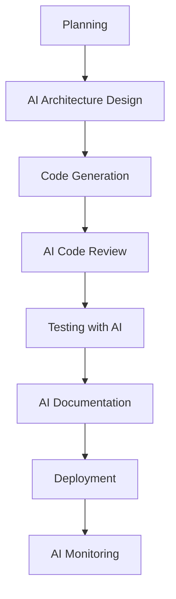

# 🤖 AI Tools untuk Developer 2025: ChatGPT, GitHub Copilot, dan Tools Terbaru yang Wajib Dicoba

Era AI telah mengubah cara developer bekerja secara fundamental. Di tahun 2025, AI tools bukan lagi sekadar "nice to have" tapi sudah menjadi kebutuhan essential untuk meningkatkan produktivitas, kualitas kode, dan efisiensi development. Mari kita explore AI tools terbaik yang wajib dikuasai developer modern!

> "AI will not replace programmers, but programmers who use AI will replace those who don't." - GitHub CEO

---

## 🎯 Mengapa AI Tools Penting untuk Developer?

### Statistik yang Mencengangkan

- **73% developer** menggunakan AI tools untuk coding (GitHub Survey 2024)
- **Produktivitas meningkat 55%** dengan AI pair programming
- **Bug reduction hingga 40%** dengan AI code review
- **Time to market 30% lebih cepat** dengan AI assistance

### Manfaat Utama AI Tools

1. **Code Generation** - Generate boilerplate code otomatis
2. **Bug Detection** - Deteksi error sebelum runtime
3. **Code Review** - Review kode otomatis dan saran improvement
4. **Documentation** - Generate dokumentasi dari kode
5. **Learning Acceleration** - Belajar teknologi baru lebih cepat

---

## 🚀 Top AI Tools untuk Developer 2025

### 1. GitHub Copilot - The AI Pair Programmer

**Rating: ⭐⭐⭐⭐⭐ (5/5)**

GitHub Copilot adalah AI coding assistant yang paling populer dan mature di 2025.

#### **Fitur Unggulan:**
- **Autocomplete Cerdas** - Suggest whole functions dan classes
- **Multi-language Support** - 30+ bahasa pemrograman
- **Context Awareness** - Memahami context project
- **Chat Integration** - Copilot Chat untuk explain code

#### **Pricing:**
- **Individual**: $10/bulan
- **Business**: $19/user/bulan
- **Enterprise**: $39/user/bulan

#### **Contoh Penggunaan:**

```javascript
// Ketik comment, Copilot akan generate function
// Function to validate email address
function validateEmail(email) {
  const emailRegex = /^[^\s@]+@[^\s@]+\.[^\s@]+$/;
  return emailRegex.test(email);
}

// Generate API call function
// Function to fetch user data from API
async function fetchUserData(userId) {
  try {
    const response = await fetch(`/api/users/${userId}`);
    if (!response.ok) {
      throw new Error(`HTTP error! status: ${response.status}`);
    }
    return await response.json();
  } catch (error) {
    console.error('Error fetching user data:', error);
    throw error;
  }
}
```

#### **Pros & Cons:**

**✅ Pros:**
- Integrasi sempurna dengan VS Code
- Akurasi tinggi untuk popular languages
- Terus belajar dari feedback
- Support untuk berbagai frameworks

**❌ Cons:**
- Subscription berbayar
- Kadang generate code yang tidak optimal
- Perlu internet connection

---

### 2. ChatGPT - The Universal AI Assistant

**Rating: ⭐⭐⭐⭐⭐ (5/5)**

ChatGPT dari OpenAI adalah AI assistant paling versatile untuk developer.

#### **Fitur Unggulan:**
- **Code Generation** - Generate code dari natural language
- **Debugging Help** - Analyze dan fix bugs
- **Architecture Planning** - Design system architecture
- **Learning Assistant** - Explain complex concepts

#### **Pricing:**
- **Free**: GPT-3.5 dengan limit
- **Plus**: $20/bulan - GPT-4 unlimited
- **Team**: $25/user/bulan
- **Enterprise**: Custom pricing

#### **Use Cases untuk Developer:**

```bash
# Contoh prompts yang efektif:

"Create a React component for user authentication with form validation"

"Explain the difference between useEffect and useLayoutHook in React"

"Debug this Python code and suggest improvements: [paste code]"

"Design a database schema for an e-commerce application"

"Convert this JavaScript function to TypeScript with proper types"
```

#### **Advanced Prompting Techniques:**

```markdown
# Template Prompt untuk Code Generation:
"""
Context: I'm building a [type of application] using [tech stack]
Task: Create a [specific component/function]
Requirements:
- [requirement 1]
- [requirement 2]
- [requirement 3]
Code style: [preferred style/conventions]
"""

# Template untuk Debugging:
"""
Problem: [describe the issue]
Expected behavior: [what should happen]
Actual behavior: [what's happening]
Code: [paste relevant code]
Error message: [if any]
Environment: [tech stack, versions]
"""
```

---

### 3. Cursor - The AI-First Code Editor

**Rating: ⭐⭐⭐⭐⭐ (5/5)**

Cursor adalah code editor yang dibangun dari ground up dengan AI integration.

#### **Fitur Unggulan:**
- **AI Chat dalam Editor** - Chat langsung dalam coding environment
- **Codebase Understanding** - AI memahami seluruh project
- **Smart Refactoring** - Refactor code dengan AI guidance
- **Natural Language Editing** - Edit code dengan natural language

#### **Pricing:**
- **Free**: Basic features
- **Pro**: $20/bulan - Advanced AI features
- **Business**: $40/user/bulan

#### **Keunggulan vs VS Code:**

```javascript
// Cursor dapat memahami context seperti ini:
// "Add error handling to all API calls in this component"
// Dan akan otomatis update semua fetch calls

// Before (manual)
const fetchData = async () => {
  const response = await fetch('/api/data');
  return response.json();
};

// After (Cursor AI suggestion)
const fetchData = async () => {
  try {
    const response = await fetch('/api/data');
    if (!response.ok) {
      throw new Error(`HTTP error! status: ${response.status}`);
    }
    return await response.json();
  } catch (error) {
    console.error('Failed to fetch data:', error);
    throw error;
  }
};
```

---

### 4. Claude (Anthropic) - The Thoughtful AI

**Rating: ⭐⭐⭐⭐⭐ (5/5)**

Claude adalah AI assistant yang fokus pada reasoning dan code quality.

#### **Fitur Unggulan:**
- **Long Context Window** - Dapat analyze large codebases
- **Code Review Excellence** - Detailed code review dan suggestions
- **Security Focus** - Identify security vulnerabilities
- **Best Practices** - Suggest industry best practices

#### **Pricing:**
- **Free**: Limited usage
- **Pro**: $20/bulan
- **Team**: $25/user/bulan

#### **Specialty untuk Developer:**

```python
# Claude excel dalam code review dan security analysis
# Contoh output Claude untuk code review:

"""
Code Review Summary:
✅ Strengths:
- Good separation of concerns
- Proper error handling
- Clear variable naming

⚠️ Improvements:
1. Add input validation (line 15)
2. Use environment variables for API keys (line 23)
3. Consider adding rate limiting (line 45)

🔒 Security Issues:
- SQL injection vulnerability (line 67)
- Sensitive data in logs (line 89)

📚 Best Practices:
- Add unit tests for edge cases
- Implement proper logging levels
- Consider using dependency injection
"""
```

---

### 5. Tabnine - The Privacy-First AI

**Rating: ⭐⭐⭐⭐ (4/5)**

Tabnine fokus pada privacy dan dapat berjalan on-premise.

#### **Fitur Unggulan:**
- **Privacy First** - Code tidak dikirim ke cloud
- **Team Training** - Train AI dengan codebase team
- **IDE Integration** - Support 20+ IDEs
- **Compliance Ready** - SOC 2, GDPR compliant

#### **Pricing:**
- **Free**: Basic autocomplete
- **Pro**: $12/user/bulan
- **Enterprise**: Custom pricing

---

## 🛠️ AI Tools Khusus untuk Specific Tasks

### Code Documentation

#### **1. Mintlify**
- Auto-generate documentation dari code
- Support untuk API docs, README, comments
- **Pricing**: Free tier available, Pro $20/bulan

```javascript
// Mintlify dapat generate docs seperti ini:
/**
 * Calculates the total price including tax
 * @param {number} basePrice - The base price before tax
 * @param {number} taxRate - The tax rate as a decimal (e.g., 0.08 for 8%)
 * @returns {number} The total price including tax
 * @example
 * calculateTotalPrice(100, 0.08) // returns 108
 */
function calculateTotalPrice(basePrice, taxRate) {
  return basePrice * (1 + taxRate);
}
```

#### **2. Codeium**
- Free alternative untuk GitHub Copilot
- Support 70+ languages
- **Pricing**: Free untuk individual

### Testing & QA

#### **1. Testim**
- AI-powered test automation
- Self-healing tests
- **Pricing**: $450/bulan per user

#### **2. Applitools**
- Visual AI testing
- Cross-browser testing
- **Pricing**: $99/bulan

### Code Review

#### **1. DeepCode (Snyk)**
- AI-powered static analysis
- Security vulnerability detection
- **Pricing**: Free tier, Pro $25/user/bulan

#### **2. SonarQube**
- Code quality analysis dengan AI
- Technical debt tracking
- **Pricing**: Free community edition

---

## 💡 Best Practices Menggunakan AI Tools

### 1. Prompt Engineering untuk Developer

```markdown
# Template Prompt yang Efektif:

## For Code Generation:
"Create a [language] [type of code] that [specific functionality]
Requirements:
- [requirement 1]
- [requirement 2]
Include error handling and comments."

## For Debugging:
"I have a bug in my [language] code. Here's what's happening:
Expected: [expected behavior]
Actual: [actual behavior]
Code: [paste code]
Help me identify and fix the issue."

## For Code Review:
"Review this [language] code for:
- Performance issues
- Security vulnerabilities  
- Best practices
- Potential bugs
Code: [paste code]"
```

### 2. AI-Assisted Development Workflow



### 3. Security Considerations

```javascript
// ❌ Jangan share sensitive data dengan AI
const apiKey = "sk-1234567890abcdef"; // Jangan paste ke AI

// ✅ Gunakan placeholder
const apiKey = process.env.API_KEY; // Safe untuk AI review

// ❌ Jangan share production URLs
const endpoint = "https://api.mycompany.com/users";

// ✅ Gunakan generic examples
const endpoint = "https://api.example.com/users";
```

### 4. Quality Control

```python
# Checklist untuk AI-generated code:
"""
✅ Code Review Checklist:
□ Functionality works as expected
□ Error handling implemented
□ Security best practices followed
□ Performance optimized
□ Code style consistent
□ Tests included
□ Documentation added
□ No hardcoded values
□ Proper variable naming
□ Edge cases handled
"""
```

---

## 📊 Perbandingan AI Tools 2025

| Tool | Best For | Pricing | Accuracy | Integration |
|------|----------|---------|----------|-------------|
| **GitHub Copilot** | General coding | $10/mo | ⭐⭐⭐⭐⭐ | ⭐⭐⭐⭐⭐ |
| **ChatGPT** | Problem solving | $20/mo | ⭐⭐⭐⭐⭐ | ⭐⭐⭐ |
| **Cursor** | AI-first editing | $20/mo | ⭐⭐⭐⭐⭐ | ⭐⭐⭐⭐⭐ |
| **Claude** | Code review | $20/mo | ⭐⭐⭐⭐⭐ | ⭐⭐⭐ |
| **Tabnine** | Privacy-focused | $12/mo | ⭐⭐⭐⭐ | ⭐⭐⭐⭐ |
| **Codeium** | Budget-friendly | Free | ⭐⭐⭐⭐ | ⭐⭐⭐⭐ |

---

## 🚀 Setup AI Development Environment

### 1. Essential VS Code Extensions

```json
{
  "recommendations": [
    "github.copilot",
    "github.copilot-chat",
    "tabnine.tabnine-vscode",
    "mintlify.document",
    "ms-vscode.vscode-ai-toolkit"
  ]
}
```

### 2. AI-Powered Terminal Setup

```bash
# Install AI-powered CLI tools
npm install -g @withfig/autocomplete
npm install -g warp-terminal
pip install thefuck
pip install howdoi

# Setup aliases untuk AI assistance
alias explain="chatgpt explain"
alias debug="chatgpt debug"
alias optimize="chatgpt optimize"
```

### 3. Git Integration dengan AI

```bash
# AI-powered commit messages
npm install -g aicommits
aicommits config set OPENAI_KEY=your-api-key

# Usage
git add .
aicommits

# Output: "feat: add user authentication with JWT tokens"
```

---

## 🎯 ROI dan Productivity Metrics

### Measuring AI Impact

```javascript
// Metrics untuk track AI productivity
const aiMetrics = {
  codeGeneration: {
    linesPerHour: 150, // vs 50 manual
    bugRate: 0.02, // vs 0.05 manual
    timeToComplete: 0.6 // 40% faster
  },
  codeReview: {
    issuesFound: 25, // vs 10 manual
    reviewTime: 0.3, // 70% faster
    falsePositives: 0.1 // 10% false positives
  },
  learning: {
    timeToUnderstand: 0.4, // 60% faster
    conceptRetention: 0.85, // 85% retention
    implementationSpeed: 0.7 // 30% faster
  }
};
```

### Cost-Benefit Analysis

```markdown
## Monthly Cost Breakdown (per developer):
- GitHub Copilot: $10
- ChatGPT Plus: $20  
- Cursor Pro: $20
- Total: $50/month

## Productivity Gains:
- 8 hours saved per week
- $50/hour developer rate
- Monthly savings: $1,600
- ROI: 3,200% (32x return)
```

---

## 🔮 Future of AI in Development

### Emerging Trends 2025

1. **AI-Generated Tests** - Automatic test case generation
2. **Intelligent Debugging** - AI yang dapat fix bugs otomatis
3. **Natural Language Programming** - Code dari plain English
4. **AI Code Architects** - AI yang design system architecture
5. **Predictive Development** - AI predict bugs sebelum terjadi

### Preparing for the Future

```python
# Skills yang perlu dikembangkan:
future_skills = {
    "prompt_engineering": "Master AI communication",
    "ai_ethics": "Understand AI limitations",
    "human_ai_collaboration": "Work effectively with AI",
    "critical_thinking": "Validate AI suggestions",
    "continuous_learning": "Adapt to new AI tools"
}
```

---

## 🎯 Action Plan: Mulai Menggunakan AI Tools

### Week 1: Foundation
- ✅ Install GitHub Copilot
- ✅ Setup ChatGPT Plus account
- ✅ Learn basic prompt engineering
- ✅ Practice dengan simple coding tasks

### Week 2: Integration
- ✅ Try Cursor editor
- ✅ Experiment dengan Claude
- ✅ Setup AI-powered terminal
- ✅ Create AI workflow templates

### Week 3: Advanced Usage
- ✅ Master advanced prompting
- ✅ Integrate AI dalam code review
- ✅ Setup team AI guidelines
- ✅ Measure productivity improvements

### Week 4: Optimization
- ✅ Fine-tune AI settings
- ✅ Create custom AI workflows
- ✅ Train team on best practices
- ✅ Establish AI governance

---

## 🔗 Resources dan Learning Materials

### Official Documentation
- [GitHub Copilot Docs](https://docs.github.com/copilot)
- [OpenAI API Documentation](https://platform.openai.com/docs)
- [Cursor Documentation](https://cursor.sh/docs)
- [Claude API Docs](https://docs.anthropic.com)

### Learning Platforms
- [Prompt Engineering Guide](https://www.promptingguide.ai)
- [AI for Developers Course](https://www.deeplearning.ai)
- [GitHub Copilot Fundamentals](https://github.com/skills/copilot)

### Communities
- [AI Developers Discord](https://discord.gg/ai-developers)
- [r/MachineLearning](https://reddit.com/r/MachineLearning)
- [AI Tools for Developers](https://github.com/ai-tools-for-developers)

---

## 🎯 Kesimpulan

AI tools telah menjadi game-changer dalam dunia development di 2025. Dengan menggunakan kombinasi yang tepat dari GitHub Copilot, ChatGPT, Cursor, dan tools lainnya, developer dapat:

- **Meningkatkan produktivitas hingga 55%**
- **Mengurangi bugs hingga 40%**
- **Mempercepat learning curve teknologi baru**
- **Fokus pada problem-solving daripada boilerplate code**

### Key Takeaways:

1. **Start Small** - Mulai dengan satu AI tool, master, lalu expand
2. **Learn Prompting** - Skill prompt engineering adalah kunci sukses
3. **Stay Critical** - Selalu review dan validate AI suggestions
4. **Keep Learning** - AI tools terus evolve, stay updated
5. **Share Knowledge** - Berbagi best practices dengan tim

AI bukan menggantikan developer, tapi developer yang menggunakan AI akan menggantikan yang tidak. Mulai journey AI Anda hari ini!

## 🔗 **Artikel Terkait:**

- [Progressive Web Apps (PWA) 2025: Panduan Lengkap](https://hilaltechnologic.info/blog/progressive-web-apps-pwa-2025-panduan-lengkap)
- [Web Security 2025: Panduan Lengkap HTTPS, CSP, dan Security Headers](https://hilaltechnologic.info/blog/web-security-2025-panduan-lengkap-https-csp-security-headers)
- [Core Web Vitals 2025: Panduan Optimasi Google Ranking](https://hilaltechnologic.info/blog/core-web-vitals-2025-panduan-optimasi-google)

---

> Ditulis dengan ❤️ oleh [Hilal Technologic](https://hilaltechnologic.info)
