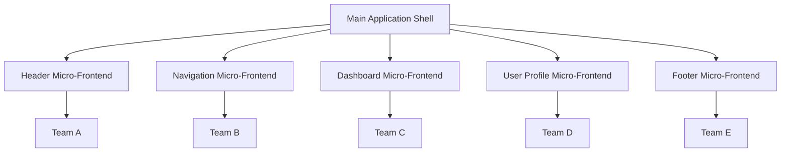

# 🏗️ Micro-Frontends: Arsitektur Modern untuk Aplikasi Web Skala Besar

Seiring berkembangnya aplikasi web menjadi semakin kompleks, traditional monolithic frontend architecture mulai menunjukkan keterbatasannya. Micro-frontends hadir sebagai solusi revolusioner yang memungkinkan tim untuk membangun, deploy, dan maintain aplikasi web skala enterprise dengan lebih efisien dan scalable.

> "Micro-frontends are the future of frontend architecture for large-scale applications." - Martin Fowler

Mari kita explore bagaimana micro-frontends dapat mengubah cara kita membangun aplikasi web modern!

---

## 🎯 Apa Itu Micro-Frontends?

Micro-frontends adalah architectural pattern yang memecah aplikasi frontend monolitik menjadi bagian-bagian kecil yang independen, dapat dikembangkan dan di-deploy secara terpisah oleh tim yang berbeda.

### Konsep Dasar



### Karakteristik Micro-Frontends

- **Independent Development** - Tim dapat bekerja secara independen
- **Technology Agnostic** - Setiap micro-frontend dapat menggunakan tech stack berbeda
- **Independent Deployment** - Deploy tanpa mempengaruhi bagian lain
- **Isolated Runtime** - Error di satu bagian tidak crash seluruh aplikasi
- **Team Ownership** - Setiap tim memiliki full ownership atas micro-frontend mereka

---

## 🚀 Mengapa Micro-Frontends Penting di 2025?

### 1. Statistik Industry

- **67% enterprise applications** menggunakan micro-frontend architecture
- **40% faster development** dengan parallel team development
- **60% reduction** dalam deployment conflicts
- **50% improvement** dalam team autonomy

### 2. Business Benefits

```javascript
const businessImpact = {
  development: {
    teamVelocity: "+40%",
    parallelDevelopment: "Multiple teams",
    timeToMarket: "-30%",
    codeReusability: "+50%"
  },
  maintenance: {
    bugIsolation: "99% contained",
    updateFrequency: "+200%",
    rollbackTime: "-80%",
    technicalDebt: "-45%"
  },
  scalability: {
    teamScaling: "Linear growth",
    codebaseSize: "Manageable chunks",
    performanceImpact: "Minimal",
    resourceUtilization: "Optimized"
  }
};
```

### 3. Technical Advantages

- **Technology Diversity** - Mix React, Vue, Angular dalam satu aplikasi
- **Independent Scaling** - Scale bagian yang membutuhkan saja
- **Fault Isolation** - Error tidak menyebar ke seluruh aplikasi
- **Incremental Migration** - Migrate legacy code secara bertahap

---

## 🏗️ Arsitektur Micro-Frontends

### 1. Application Shell Pattern

```javascript
// Shell Application (Container)
class MicroFrontendShell {
  constructor() {
    this.microfrontends = new Map();
    this.router = new Router();
    this.eventBus = new EventBus();
  }

  registerMicroFrontend(name, config) {
    this.microfrontends.set(name, {
      url: config.url,
      routes: config.routes,
      container: config.container,
      lifecycle: config.lifecycle
    });
  }

  async loadMicroFrontend(name) {
    const config = this.microfrontends.get(name);
    
    try {
      // Load micro-frontend bundle
      const module = await import(config.url);
      
      // Mount to container
      await module.mount(config.container, {
        eventBus: this.eventBus,
        router: this.router
      });
      
      return module;
    } catch (error) {
      console.error(`Failed to load micro-frontend: ${name}`, error);
      this.loadFallback(name);
    }
  }

  loadFallback(name) {
    const container = document.querySelector(`#${name}-container`);
    container.innerHTML = `
      <div class="error-fallback">
        <h3>Service Temporarily Unavailable</h3>
        <p>We're working to restore this feature.</p>
      </div>
    `;
  }
}

// Usage
const shell = new MicroFrontendShell();

shell.registerMicroFrontend('dashboard', {
  url: 'https://dashboard.example.com/bundle.js',
  routes: ['/dashboard', '/analytics'],
  container: '#dashboard-container'
});

shell.registerMicroFrontend('profile', {
  url: 'https://profile.example.com/bundle.js',
  routes: ['/profile', '/settings'],
  container: '#profile-container'
});
```

### 2. Communication Patterns

```javascript
// Event Bus untuk komunikasi antar micro-frontends
class MicroFrontendEventBus {
  constructor() {
    this.events = new Map();
  }

  subscribe(event, callback) {
    if (!this.events.has(event)) {
      this.events.set(event, []);
    }
    this.events.get(event).push(callback);
  }

  publish(event, data) {
    if (this.events.has(event)) {
      this.events.get(event).forEach(callback => {
        try {
          callback(data);
        } catch (error) {
          console.error(`Error in event handler for ${event}:`, error);
        }
      });
    }
  }

  unsubscribe(event, callback) {
    if (this.events.has(event)) {
      const callbacks = this.events.get(event);
      const index = callbacks.indexOf(callback);
      if (index > -1) {
        callbacks.splice(index, 1);
      }
    }
  }
}

// Shared State Management
class SharedStateManager {
  constructor() {
    this.state = new Proxy({}, {
      set: (target, property, value) => {
        target[property] = value;
        this.notifySubscribers(property, value);
        return true;
      }
    });
    this.subscribers = new Map();
  }

  subscribe(key, callback) {
    if (!this.subscribers.has(key)) {
      this.subscribers.set(key, []);
    }
    this.subscribers.get(key).push(callback);
  }

  notifySubscribers(key, value) {
    if (this.subscribers.has(key)) {
      this.subscribers.get(key).forEach(callback => callback(value));
    }
  }

  setState(key, value) {
    this.state[key] = value;
  }

  getState(key) {
    return this.state[key];
  }
}
```

---

## 🛠️ Implementation Approaches

### 1. Module Federation (Webpack 5)

Module Federation adalah solusi native Webpack untuk micro-frontends.

```javascript
// webpack.config.js - Host Application
const ModuleFederationPlugin = require('@module-federation/webpack');

module.exports = {
  mode: 'development',
  devServer: {
    port: 3000,
  },
  plugins: [
    new ModuleFederationPlugin({
      name: 'shell',
      remotes: {
        dashboard: 'dashboard@http://localhost:3001/remoteEntry.js',
        profile: 'profile@http://localhost:3002/remoteEntry.js',
        products: 'products@http://localhost:3003/remoteEntry.js',
      },
    }),
  ],
};

// webpack.config.js - Dashboard Micro-Frontend
module.exports = {
  mode: 'development',
  devServer: {
    port: 3001,
  },
  plugins: [
    new ModuleFederationPlugin({
      name: 'dashboard',
      filename: 'remoteEntry.js',
      exposes: {
        './Dashboard': './src/Dashboard',
        './Analytics': './src/Analytics',
      },
      shared: {
        react: { singleton: true },
        'react-dom': { singleton: true },
      },
    }),
  ],
};
```

```jsx
// Host Application - Loading Remote Components
import React, { Suspense } from 'react';

const Dashboard = React.lazy(() => import('dashboard/Dashboard'));
const Profile = React.lazy(() => import('profile/Profile'));

function App() {
  return (
    <div className="app">
      <header>
        <h1>My Application</h1>
      </header>
      
      <main>
        <Suspense fallback={<div>Loading Dashboard...</div>}>
          <Dashboard />
        </Suspense>
        
        <Suspense fallback={<div>Loading Profile...</div>}>
          <Profile />
        </Suspense>
      </main>
    </div>
  );
}

export default App;
```

### 2. Single-SPA Framework

Single-SPA adalah framework untuk orchestrating micro-frontends.

```javascript
// single-spa-config.js
import { registerApplication, start } from 'single-spa';

// Register Dashboard Micro-Frontend
registerApplication({
  name: 'dashboard',
  app: () => import('./microfrontends/dashboard/main.js'),
  activeWhen: ['/dashboard'],
  customProps: {
    authToken: () => localStorage.getItem('authToken'),
    apiUrl: process.env.API_URL
  }
});

// Register Profile Micro-Frontend
registerApplication({
  name: 'profile',
  app: () => import('./microfrontends/profile/main.js'),
  activeWhen: ['/profile', '/settings'],
  customProps: {
    userId: () => getCurrentUserId()
  }
});

// Register Navigation (always active)
registerApplication({
  name: 'navigation',
  app: () => import('./microfrontends/navigation/main.js'),
  activeWhen: () => true
});

start();
```

```javascript
// Dashboard Micro-Frontend - main.js
import React from 'react';
import ReactDOM from 'react-dom';
import singleSpaReact from 'single-spa-react';
import Dashboard from './Dashboard';

const lifecycles = singleSpaReact({
  React,
  ReactDOM,
  rootComponent: Dashboard,
  errorBoundary(err, info, props) {
    return (
      <div className="error-boundary">
        <h2>Dashboard Error</h2>
        <p>Something went wrong in the dashboard.</p>
      </div>
    );
  },
});

export const { bootstrap, mount, unmount } = lifecycles;
```

### 3. Web Components Approach

```javascript
// Dashboard Web Component
class DashboardMicroFrontend extends HTMLElement {
  constructor() {
    super();
    this.attachShadow({ mode: 'open' });
  }

  connectedCallback() {
    this.render();
    this.setupEventListeners();
  }

  disconnectedCallback() {
    this.cleanup();
  }

  render() {
    this.shadowRoot.innerHTML = `
      <style>
        :host {
          display: block;
          padding: 20px;
          border: 1px solid #ddd;
          border-radius: 8px;
        }
        .dashboard {
          background: #f5f5f5;
          padding: 16px;
        }
      </style>
      <div class="dashboard">
        <h2>Dashboard</h2>
        <div id="content"></div>
      </div>
    `;
    
    this.loadDashboardData();
  }

  async loadDashboardData() {
    try {
      const response = await fetch('/api/dashboard');
      const data = await response.json();
      this.updateContent(data);
    } catch (error) {
      this.showError(error);
    }
  }

  updateContent(data) {
    const content = this.shadowRoot.querySelector('#content');
    content.innerHTML = `
      <div class="metrics">
        <div class="metric">
          <h3>Users</h3>
          <span>${data.users}</span>
        </div>
        <div class="metric">
          <h3>Revenue</h3>
          <span>$${data.revenue}</span>
        </div>
      </div>
    `;
  }

  setupEventListeners() {
    window.addEventListener('user-updated', this.handleUserUpdate.bind(this));
  }

  handleUserUpdate(event) {
    console.log('User updated:', event.detail);
    this.loadDashboardData();
  }

  cleanup() {
    window.removeEventListener('user-updated', this.handleUserUpdate);
  }
}

customElements.define('dashboard-microfrontend', DashboardMicroFrontend);
```

---

## 🔧 Tools dan Frameworks

### 1. Module Federation Tools

```javascript
// @module-federation/webpack - Enhanced Module Federation
const { ModuleFederationPlugin } = require('@module-federation/webpack');

module.exports = {
  plugins: [
    new ModuleFederationPlugin({
      name: 'host',
      remotes: {
        mf1: 'mf1@http://localhost:3001/remoteEntry.js',
      },
      shared: {
        react: {
          singleton: true,
          requiredVersion: '^18.0.0',
        },
        'react-dom': {
          singleton: true,
          requiredVersion: '^18.0.0',
        },
      },
    }),
  ],
};

// @module-federation/nextjs - Next.js Integration
const { NextFederationPlugin } = require('@module-federation/nextjs');

module.exports = {
  webpack: (config) => {
    config.plugins.push(
      new NextFederationPlugin({
        name: 'nextjs-host',
        remotes: {
          dashboard: 'dashboard@http://localhost:3001/_next/static/chunks/remoteEntry.js',
        },
      })
    );
    return config;
  },
};
```

### 2. Single-SPA Ecosystem

```bash
# Install Single-SPA CLI
npm install -g create-single-spa

# Create new micro-frontend
create-single-spa --moduleType app-parcel --framework react

# Create root config
create-single-spa --moduleType root-config

# Create utility module
create-single-spa --moduleType util-module
```

```javascript
// single-spa-layout for declarative routing
import { constructApplications, constructRoutes } from 'single-spa-layout';

const routes = constructRoutes(`
  <single-spa-router>
    <application name="navbar"></application>
    <route path="/dashboard">
      <application name="dashboard"></application>
    </route>
    <route path="/profile">
      <application name="profile"></application>
    </route>
    <route default>
      <application name="home"></application>
    </route>
  </single-spa-router>
`);

const applications = constructApplications({
  routes,
  loadApp: ({ name }) => import(`./microfrontends/${name}/main.js`),
});
```

### 3. Micro-Frontend Frameworks

#### **Bit.dev**
```bash
# Install Bit
npm install -g @teambit/bvm
bvm install

# Initialize workspace
bit init --harmony

# Create component
bit create react-component ui/button

# Export component
bit tag --all
bit export
```

#### **Piral**
```javascript
// Piral Shell
import { createPiralInstance } from 'piral';

const instance = createPiralInstance({
  requestPilets() {
    return fetch('/api/pilets')
      .then(res => res.json())
      .then(pilets => pilets.map(pilet => ({
        ...pilet,
        link: pilet.link
      })));
  },
});

instance.root.render();
```

---

## 🎨 Design Patterns dan Best Practices

### 1. Shared Design System

```javascript
// Design System Package
// @company/design-system

export const Button = ({ variant, children, ...props }) => {
  const baseStyles = 'px-4 py-2 rounded font-medium';
  const variants = {
    primary: 'bg-blue-500 text-white hover:bg-blue-600',
    secondary: 'bg-gray-200 text-gray-800 hover:bg-gray-300',
    danger: 'bg-red-500 text-white hover:bg-red-600'
  };

  return (
    <button 
      className={`${baseStyles} ${variants[variant]}`}
      {...props}
    >
      {children}
    </button>
  );
};

export const theme = {
  colors: {
    primary: '#3b82f6',
    secondary: '#6b7280',
    danger: '#ef4444'
  },
  spacing: {
    xs: '0.25rem',
    sm: '0.5rem',
    md: '1rem',
    lg: '1.5rem',
    xl: '2rem'
  }
};
```

### 2. Error Boundaries

```jsx
// Micro-Frontend Error Boundary
class MicroFrontendErrorBoundary extends React.Component {
  constructor(props) {
    super(props);
    this.state = { hasError: false, error: null };
  }

  static getDerivedStateFromError(error) {
    return { hasError: true, error };
  }

  componentDidCatch(error, errorInfo) {
    // Log error to monitoring service
    console.error('Micro-frontend error:', error, errorInfo);
    
    // Send to error tracking
    if (window.Sentry) {
      window.Sentry.captureException(error, {
        tags: {
          microfrontend: this.props.name,
          boundary: 'micro-frontend'
        },
        extra: errorInfo
      });
    }
  }

  render() {
    if (this.state.hasError) {
      return (
        <div className="error-fallback">
          <h3>Something went wrong in {this.props.name}</h3>
          <details>
            <summary>Error details</summary>
            <pre>{this.state.error?.toString()}</pre>
          </details>
          <button 
            onClick={() => this.setState({ hasError: false, error: null })}
          >
            Try again
          </button>
        </div>
      );
    }

    return this.props.children;
  }
}

// Usage
function App() {
  return (
    <div>
      <MicroFrontendErrorBoundary name="Dashboard">
        <Dashboard />
      </MicroFrontendErrorBoundary>
      
      <MicroFrontendErrorBoundary name="Profile">
        <Profile />
      </MicroFrontendErrorBoundary>
    </div>
  );
}
```

### 3. Performance Optimization

```javascript
// Lazy Loading dengan Intersection Observer
class MicroFrontendLoader {
  constructor() {
    this.observer = new IntersectionObserver(
      this.handleIntersection.bind(this),
      { threshold: 0.1 }
    );
    this.loadedMicroFrontends = new Set();
  }

  observe(element, microfrontendName) {
    element.dataset.microfrontend = microfrontendName;
    this.observer.observe(element);
  }

  async handleIntersection(entries) {
    for (const entry of entries) {
      if (entry.isIntersecting) {
        const name = entry.target.dataset.microfrontend;
        
        if (!this.loadedMicroFrontends.has(name)) {
          await this.loadMicroFrontend(name, entry.target);
          this.loadedMicroFrontends.add(name);
          this.observer.unobserve(entry.target);
        }
      }
    }
  }

  async loadMicroFrontend(name, container) {
    try {
      // Show loading state
      container.innerHTML = '<div class="loading">Loading...</div>';
      
      // Dynamic import
      const module = await import(`./microfrontends/${name}/index.js`);
      
      // Mount micro-frontend
      await module.mount(container);
      
    } catch (error) {
      console.error(`Failed to load ${name}:`, error);
      container.innerHTML = `
        <div class="error">
          Failed to load ${name}. 
          <button onclick="location.reload()">Retry</button>
        </div>
      `;
    }
  }
}

// Usage
const loader = new MicroFrontendLoader();

document.querySelectorAll('[data-microfrontend]').forEach(element => {
  const name = element.dataset.microfrontend;
  loader.observe(element, name);
});
```

---

## 🔒 Security Considerations

### 1. Content Security Policy

```javascript
// CSP untuk Micro-Frontends
const cspConfig = {
  'default-src': ["'self'"],
  'script-src': [
    "'self'",
    "'unsafe-inline'", // Untuk dynamic imports
    "https://dashboard.example.com",
    "https://profile.example.com",
    "https://cdn.example.com"
  ],
  'style-src': [
    "'self'",
    "'unsafe-inline'",
    "https://fonts.googleapis.com"
  ],
  'connect-src': [
    "'self'",
    "https://api.example.com",
    "wss://realtime.example.com"
  ],
  'frame-src': [
    "https://trusted-microfrontend.example.com"
  ]
};

// Generate CSP header
const cspHeader = Object.entries(cspConfig)
  .map(([directive, sources]) => `${directive} ${sources.join(' ')}`)
  .join('; ');
```

### 2. Authentication & Authorization

```javascript
// Shared Auth Service
class AuthService {
  constructor() {
    this.token = localStorage.getItem('authToken');
    this.user = null;
    this.subscribers = [];
  }

  async login(credentials) {
    try {
      const response = await fetch('/api/auth/login', {
        method: 'POST',
        headers: { 'Content-Type': 'application/json' },
        body: JSON.stringify(credentials)
      });

      const { token, user } = await response.json();
      
      this.token = token;
      this.user = user;
      localStorage.setItem('authToken', token);
      
      this.notifySubscribers({ type: 'LOGIN', user });
      
      return { success: true, user };
    } catch (error) {
      return { success: false, error: error.message };
    }
  }

  logout() {
    this.token = null;
    this.user = null;
    localStorage.removeItem('authToken');
    this.notifySubscribers({ type: 'LOGOUT' });
  }

  subscribe(callback) {
    this.subscribers.push(callback);
    return () => {
      const index = this.subscribers.indexOf(callback);
      if (index > -1) {
        this.subscribers.splice(index, 1);
      }
    };
  }

  notifySubscribers(event) {
    this.subscribers.forEach(callback => callback(event));
  }

  getAuthHeaders() {
    return this.token ? { Authorization: `Bearer ${this.token}` } : {};
  }

  hasPermission(permission) {
    return this.user?.permissions?.includes(permission) || false;
  }
}

// Shared instance
window.authService = new AuthService();
```

### 3. Data Isolation

```javascript
// Secure Data Store
class SecureMicroFrontendStore {
  constructor(namespace) {
    this.namespace = namespace;
    this.data = new Map();
    this.encryptionKey = this.generateKey();
  }

  generateKey() {
    return crypto.getRandomValues(new Uint8Array(32));
  }

  async encrypt(data) {
    const encoder = new TextEncoder();
    const dataBuffer = encoder.encode(JSON.stringify(data));
    
    const key = await crypto.subtle.importKey(
      'raw',
      this.encryptionKey,
      { name: 'AES-GCM' },
      false,
      ['encrypt']
    );

    const iv = crypto.getRandomValues(new Uint8Array(12));
    const encrypted = await crypto.subtle.encrypt(
      { name: 'AES-GCM', iv },
      key,
      dataBuffer
    );

    return { encrypted, iv };
  }

  async decrypt(encryptedData, iv) {
    const key = await crypto.subtle.importKey(
      'raw',
      this.encryptionKey,
      { name: 'AES-GCM' },
      false,
      ['decrypt']
    );

    const decrypted = await crypto.subtle.decrypt(
      { name: 'AES-GCM', iv },
      key,
      encryptedData
    );

    const decoder = new TextDecoder();
    return JSON.parse(decoder.decode(decrypted));
  }

  async setItem(key, value) {
    const fullKey = `${this.namespace}:${key}`;
    const { encrypted, iv } = await this.encrypt(value);
    
    sessionStorage.setItem(fullKey, JSON.stringify({
      data: Array.from(new Uint8Array(encrypted)),
      iv: Array.from(iv)
    }));
  }

  async getItem(key) {
    const fullKey = `${this.namespace}:${key}`;
    const stored = sessionStorage.getItem(fullKey);
    
    if (!stored) return null;

    const { data, iv } = JSON.parse(stored);
    const encrypted = new Uint8Array(data).buffer;
    const ivArray = new Uint8Array(iv);

    return await this.decrypt(encrypted, ivArray);
  }
}
```

---

## 📊 Monitoring dan Observability

### 1. Performance Monitoring

```javascript
// Micro-Frontend Performance Monitor
class MicroFrontendMonitor {
  constructor() {
    this.metrics = new Map();
    this.observer = new PerformanceObserver(this.handlePerformanceEntry.bind(this));
    this.observer.observe({ entryTypes: ['measure', 'navigation', 'resource'] });
  }

  startTiming(name) {
    performance.mark(`${name}-start`);
  }

  endTiming(name) {
    performance.mark(`${name}-end`);
    performance.measure(name, `${name}-start`, `${name}-end`);
  }

  handlePerformanceEntry(list) {
    for (const entry of list.getEntries()) {
      if (entry.entryType === 'measure') {
        this.recordMetric(entry.name, entry.duration);
      }
    }
  }

  recordMetric(name, value) {
    if (!this.metrics.has(name)) {
      this.metrics.set(name, []);
    }
    
    this.metrics.get(name).push({
      value,
      timestamp: Date.now()
    });

    // Send to monitoring service
    this.sendMetric(name, value);
  }

  sendMetric(name, value) {
    if (window.analytics) {
      window.analytics.track('Micro-Frontend Performance', {
        metric: name,
        value,
        timestamp: Date.now()
      });
    }
  }

  getMetrics() {
    const summary = {};
    
    for (const [name, values] of this.metrics) {
      const recent = values.slice(-10); // Last 10 measurements
      summary[name] = {
        average: recent.reduce((sum, m) => sum + m.value, 0) / recent.length,
        min: Math.min(...recent.map(m => m.value)),
        max: Math.max(...recent.map(m => m.value)),
        count: recent.length
      };
    }
    
    return summary;
  }
}

// Usage
const monitor = new MicroFrontendMonitor();

// Monitor micro-frontend loading
monitor.startTiming('dashboard-load');
await loadDashboard();
monitor.endTiming('dashboard-load');
```

### 2. Error Tracking

```javascript
// Centralized Error Tracking
class MicroFrontendErrorTracker {
  constructor() {
    this.errors = [];
    this.setupGlobalErrorHandlers();
  }

  setupGlobalErrorHandlers() {
    // JavaScript errors
    window.addEventListener('error', (event) => {
      this.trackError({
        type: 'javascript',
        message: event.message,
        filename: event.filename,
        lineno: event.lineno,
        colno: event.colno,
        stack: event.error?.stack,
        microfrontend: this.detectMicroFrontend(event.filename)
      });
    });

    // Promise rejections
    window.addEventListener('unhandledrejection', (event) => {
      this.trackError({
        type: 'promise',
        message: event.reason?.message || 'Unhandled Promise Rejection',
        stack: event.reason?.stack,
        microfrontend: this.detectMicroFrontendFromStack(event.reason?.stack)
      });
    });

    // Resource loading errors
    window.addEventListener('error', (event) => {
      if (event.target !== window) {
        this.trackError({
          type: 'resource',
          message: `Failed to load ${event.target.tagName}`,
          source: event.target.src || event.target.href,
          microfrontend: this.detectMicroFrontend(event.target.src)
        });
      }
    }, true);
  }

  detectMicroFrontend(url) {
    if (!url) return 'unknown';
    
    const microfrontendPatterns = {
      'dashboard': /dashboard\./,
      'profile': /profile\./,
      'products': /products\./
    };

    for (const [name, pattern] of Object.entries(microfrontendPatterns)) {
      if (pattern.test(url)) {
